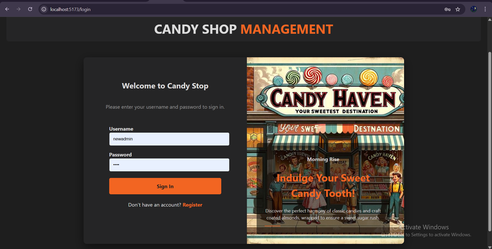
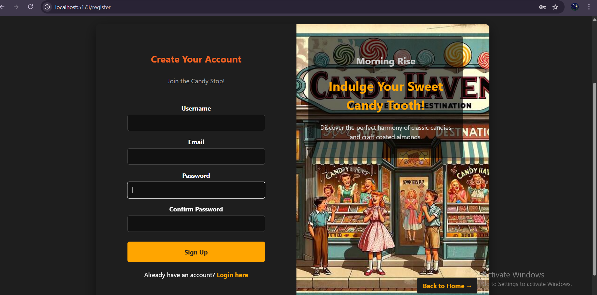
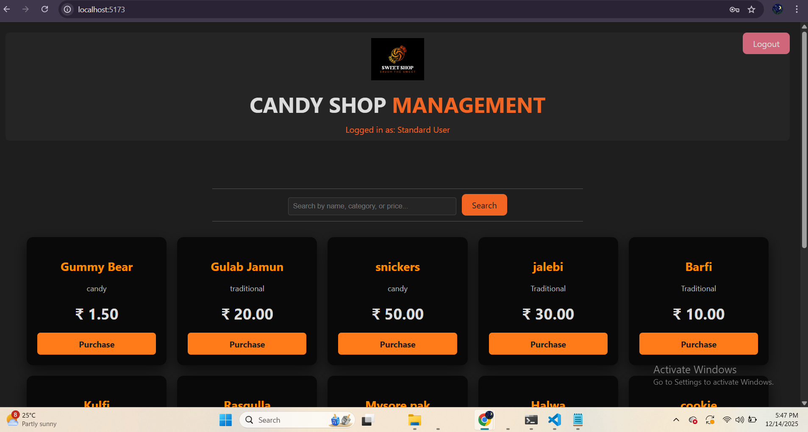
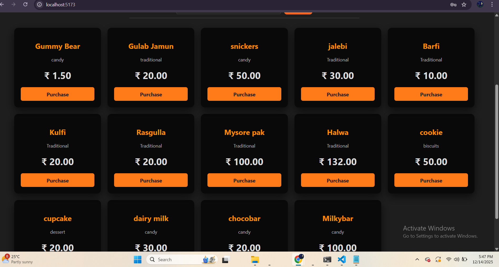
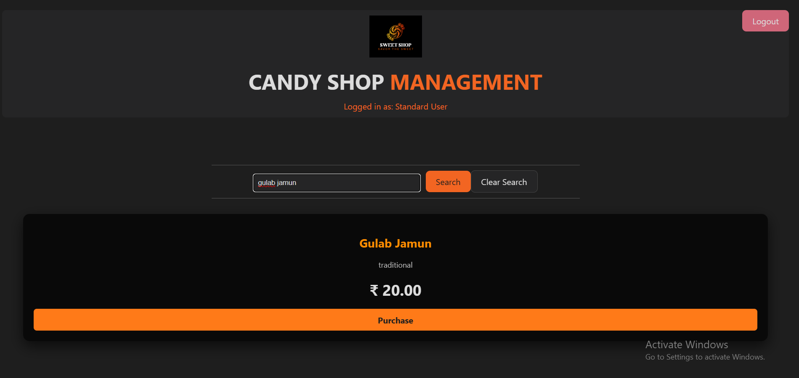

# 🍬 Sweet Shop Management System

A full-stack **Sweet Shop Management System** built as part of an **AI Kata / TDD Assignment**.  
This project demonstrates backend API development, frontend integration, authentication, role-based access, and clean UI practices.

---

## 🚀 Features

### 👤 Authentication
- User registration and login
- JWT-based authentication
- Role-based access (Admin vs Standard User)

### 🍭 Sweets Management
- View all available sweets
- Search sweets by name, category, or price
- Purchase sweets (quantity decreases)
- Quantity never shown to standard users

### 🔐 Admin-Only Features
- Add new sweets
- Edit sweet details
- Delete sweets
- Restock inventory

### 🎨 Frontend UI
- Built with **React + Vite**
- Responsive dark theme
- Clean product listing layout
- Separate admin and user experiences

---

## 🛠 Tech Stack

### Backend
- **Python**
- **Django**
- **Django REST Framework**
- **SimpleJWT**
- **SQLite**
- **django-cors-headers**

### Frontend
- **React**
- **Vite**
- **JavaScript**
- **Fetch API**
- **JWT Decode**

---

## 📂 Project Structure

```text
sweet-shop-management/
├── backend/
│   ├── api/
│   ├── sweetshop/
│   └── manage.py
├── frontend/
│   ├── src/
│   │   ├── Login.jsx
│   │   ├── Register.jsx
│   │   ├── Sweets.jsx
│   │   ├── AddSweetForm.jsx
│   │   └── api.js
│   └── package.json
└── README.md

### Login Page

### register page

### userdisplay

### user display

### search

### admin panel Page


